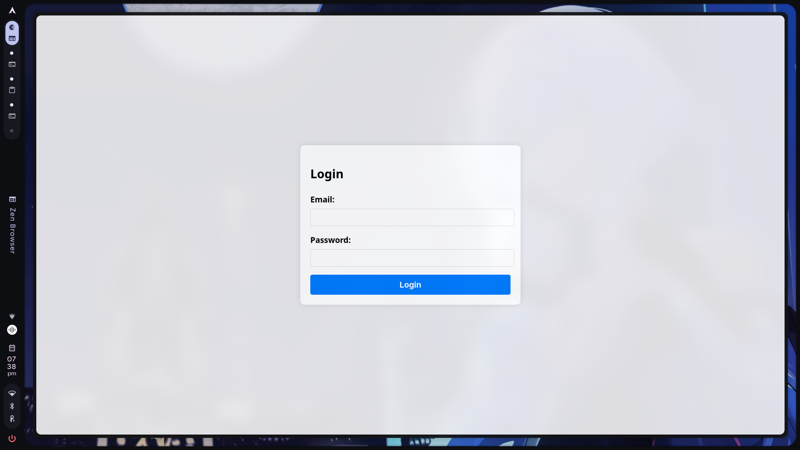
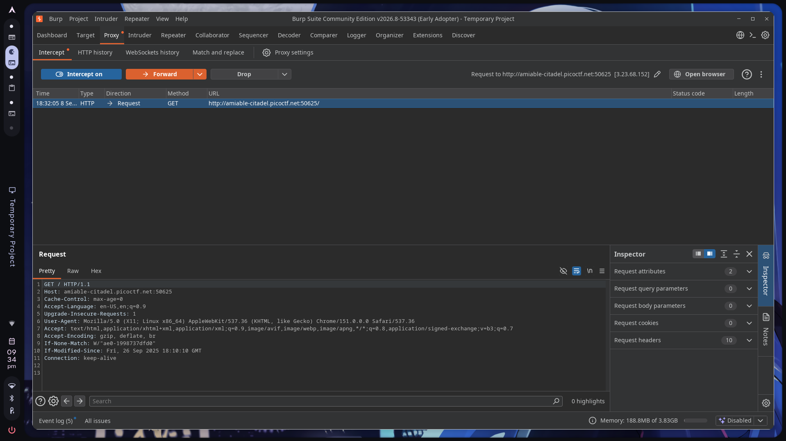
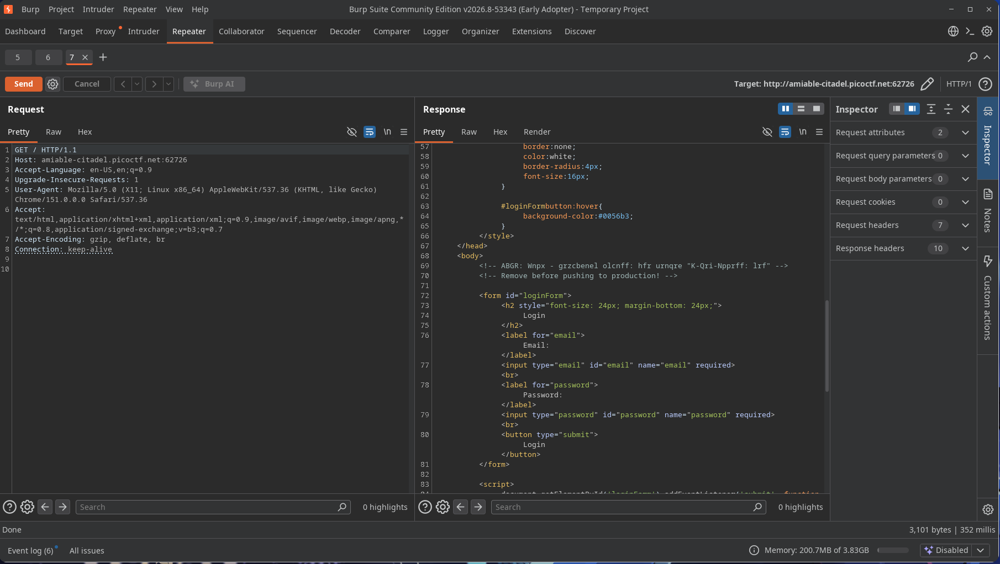
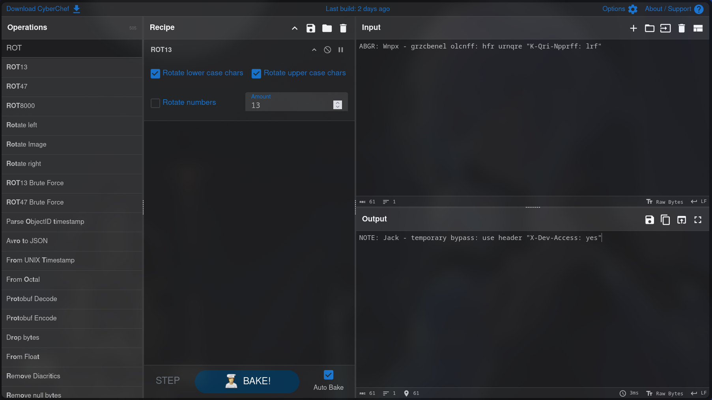
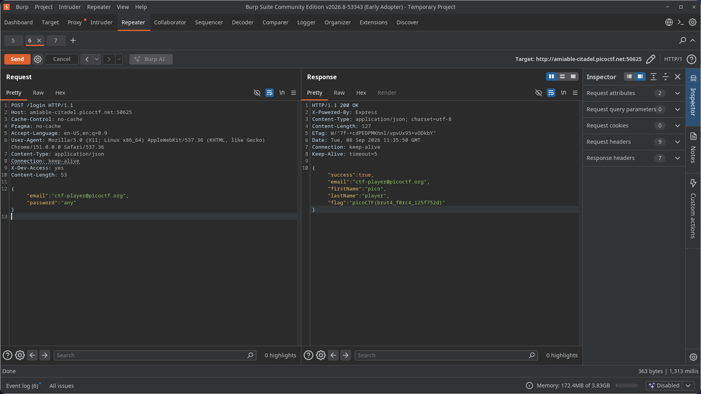

# Crack The Gate 1

> **Platform:** picoCTF
>
> **Category:** Web Exploitation
>
> **Difficulty:** Easy

## Summary

The login page hid a developer note in an HTML comment. Decoding its ROT13 text exposed a temporary `X-Dev-Access: yes` header, and the server treated that client-controlled header as a password bypass.

## Challenge

> We're in the middle of an investigation where one of our persons of interest,
> ctf player, is believed to be hiding sensitive data inside a restricted web
> portal. Although we uncovered the email address he uses to log in,
> `ctf-player@picoctf.org`,
> we unfortunately don't know the password since the usual guessing techniques
> haven't worked. However, something feels off as if the developer left a secret
> way in, so can you figure it out?

## Solution

### Step 1: Inspect the login response



*The login page only exposes email and password fields.*

The challenge gave me `ctf-player@picoctf.org`, but not the password. Since password guessing had already failed and the prompt hinted at a hidden way in, I inspected the HTTP response instead of treating the login form like a slot machine.



*Burp Proxy intercepting the initial `GET /` request.*

I intercepted the initial request with Burp Proxy and sent it to Burp Repeater. When the UI refuses to tell you anything useful, the HTTP traffic usually has fewer manners.



*The HTML response contains an encoded developer note inside a comment.*

The response body contained an HTML comment that never appeared in the rendered login page:

> `ABGR: Wnpx - grzcbenel olcnff: hfr urnqre "K-Qri-Npprff: lrf"`

The spaces and punctuation were intact while the letters had been substituted, which pointed to a simple rotation cipher.

### Step 2: Decode the developer note

I suspected ROT13, a Caesar cipher variant that shifts each letter by 13 positions. I used CyberChef to test it against the comment.



*CyberChef decoding the comment with ROT13.*

ROT13 decoded the comment to:

> `NOTE: Jack - temporary bypass: use header "X-Dev-Access: yes"`

### Step 3: Send the bypass header

In Burp Repeater, I added the bypass header to the login request and used the supplied email with an arbitrary password:

```http
POST /login HTTP/1.1
Host: amiable-citadel.picoctf.net:50625
Content-Type: application/json
X-Dev-Access: yes

{
  "email": "ctf-player@picoctf.org",
  "password": "any"
}
```



*The modified request returns `HTTP/1.1 200 OK`, `"success": true`, and the flag.*

The server returned `HTTP/1.1 200 OK` and a JSON body containing `"success": true` and the flag, even though the password was arbitrary. Apparently, the password field was mostly there for decoration.

```json
{
  "success": true,
  "email": "ctf-player@picoctf.org",
  "firstName": "pico",
  "lastName": "ctfplayer",
  "flag": "picoCTF{brut4_f0rc4_125f752d}"
}
```

## Why It Works

The server trusts `X-Dev-Access: yes` as proof that the request may skip password validation. HTTP request headers come from the client, so anyone can add that header in Burp Repeater, `curl`, or any HTTP library. The temporary developer bypass became public authentication logic with a very optimistic trust boundary.

## Vulnerability

- **Type:** Authentication bypass through a client-controlled HTTP header
- **Location:** `POST /login` handling
- **Root cause:** Production code accepts the presence and value of `X-Dev-Access` instead of verifying the user's password through a server-side authentication flow.

## Mitigation

- Remove development bypasses before deployment; feature flags for them must default to disabled in production.
- Authenticate the supplied credentials on the server before issuing a session or returning account data.
- Never treat a request header that an external client can set as authorization by itself.

## Flag

```text
picoCTF{brut4_f0rc4_125f752d}
```

## Lessons Learned

- Check the response source, not only the rendered page. In this challenge, the developer note was exposed in an HTML comment.
- ROT13 only obscured the note; CyberChef reversed it immediately.
- A client-controlled header cannot safely authorize a user. The server accepted `X-Dev-Access: yes` even when the request contained an arbitrary password.

## References

- [OWASP Authentication Cheat Sheet](https://cheatsheetseries.owasp.org/cheatsheets/Authentication_Cheat_Sheet.html)
