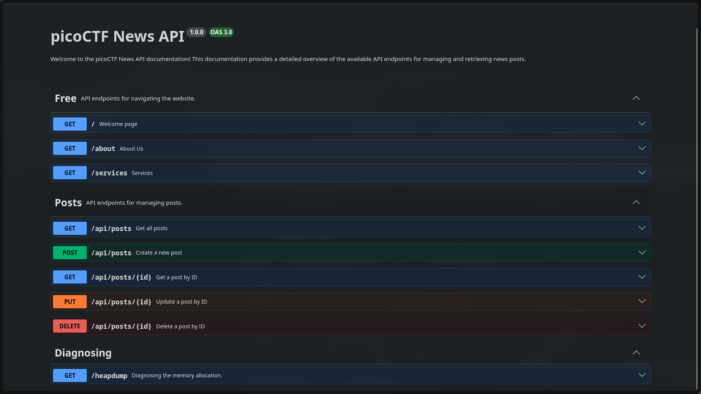
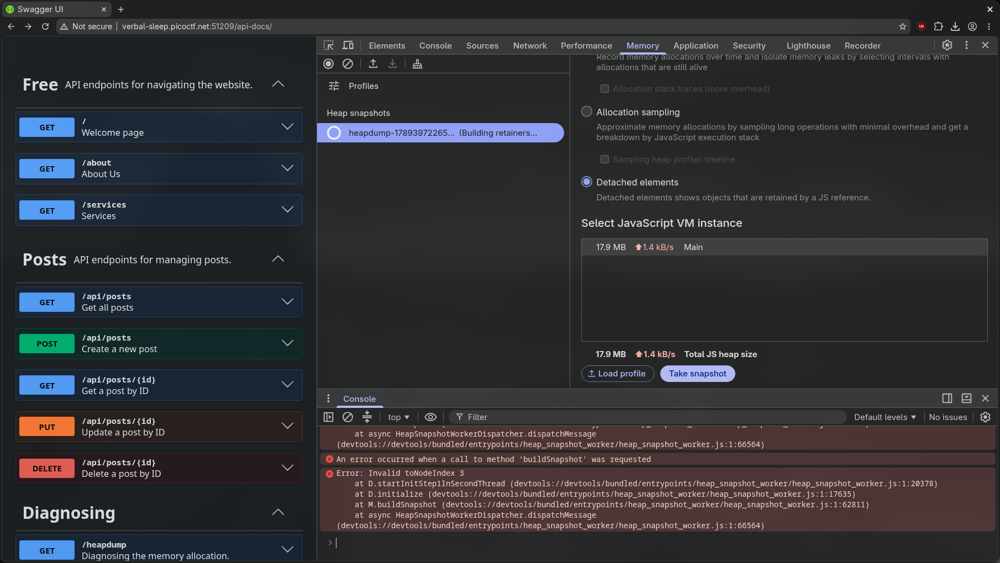
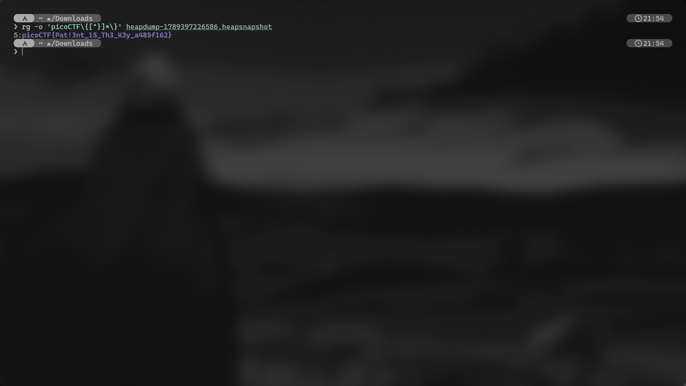

# head-dump

> **Platform:** picoCTF  
> **Category:** Web Exploitation  
> **Difficulty:** Easy

## Summary

The application exposed an unauthenticated `/heapdump` endpoint through its public Swagger documentation. The downloaded V8 heap snapshot still contained the flag as a string, so I extracted it with `ripgrep` instead of parsing the entire snapshot.

## Challenge

> Welcome to the challenge! In this challenge, you will explore a web application and find an endpoint that exposes a file containing a hidden flag.
>
> The application is a simple blog website where you can read articles about various topics, including an article about API Documentation. Your goal is to explore the application and find the endpoint that generates files holding the server's memory, where a secret flag is hidden.

## Provided Information

- **Hint 1:** Explore backend development with us.
- **Hint 2:** The head was dumped.

## Solution

### Step 1: Find the diagnostic endpoint

The main page contained a post tagged `#nodejs`, `#swagger UI`, and `#API Documentation`:


Opening the API documentation took me to `/api-docs/`, where Swagger UI listed the application's routes. Under **Diagnosing**, one endpoint stood out:

```http
GET /heapdump
```



The endpoint was described as “Diagnosing the memory allocation.” Very considerate of the application to document the data leak before I had to look for it.

Swagger made the endpoint easy to discover, but hiding the documentation would not fix the vulnerability. The real problem was that `/heapdump` itself could be called without authentication.

### Step 2: Download the heap snapshot

I called the endpoint from Swagger UI. The underlying request was:

```http
GET /heapdump HTTP/1.1
Host: verbal-sleep.picoctf.net:51209
```

The server returned a file named `heapdump-1789397226586.heapsnapshot`. A V8 heap snapshot is a JSON-serialized representation of the current V8 heap, not a raw dump of every byte in the server's RAM.

I first tried loading the file in Chrome DevTools through the **Memory** tab, but DevTools failed while building the snapshot:

```text
Error: Invalid toNodeIndex 3
```



The screenshot proves the parser failed in my environment, but not why. A V8-version mismatch is possible because the heap-snapshot schema is version-specific, although I did not confirm that as the cause. Fortunately, I only needed one string, not a guided tour through the entire object graph.

### Step 3: Extract the flag with ripgrep

Because picoCTF flags use a predictable format, I searched the snapshot as text:

```bash
rg -o 'picoCTF\{[^}]*\}' heapdump-1789397226586.heapsnapshot
```

The command returned:

```text
5:picoCTF{Pat13nt_15_Th3_K3y_a485f162}
```



The `5:` prefix is the line number reported by `ripgrep`; it is not part of the flag. The rest of the command is small but deliberate:

- `-o` prints only the matching text instead of flooding the terminal with the surrounding snapshot data.
- `picoCTF\{` matches the flag prefix and its opening brace.
- `[^}]*` consumes characters until the closing brace.
- `\}` matches the final brace.

## Why It Works

The `/heapdump` endpoint returned a serialized view of the application's V8 heap to an unauthenticated client. At the moment the snapshot was generated, the flag string was still retained in that heap and therefore appeared in the JSON output.

`ripgrep` did not need to understand the heap graph or its V8-specific schema. It scanned the serialized file for the known `picoCTF{...}` pattern and printed the matching string directly. Chrome wanted a valid object graph; I wanted twenty-something suspicious characters. We had different priorities.

## Vulnerability

- **Type:** Sensitive information disclosure through an exposed diagnostic endpoint
- **Location:** `GET /heapdump`
- **Root cause:** The production application allowed an unauthenticated user to generate and download a V8 heap snapshot containing process data. The public Swagger page made discovery easier, but the missing access control on `/heapdump` caused the exposure.
## Flag

```text
picoCTF{Pat13nt_15_Th3_K3y_a485f162}
```

## Lessons Learned

- Public API documentation can provide a convenient map of the attack surface, but removing Swagger does not repair an exposed endpoint.
- Heap snapshots describe the V8 heap rather than the server's entire RAM, yet they can still expose sensitive strings retained by the application.
- When the target has a known pattern, searching the serialized snapshot can be faster and less fragile than loading its full graph into a GUI profiler.

## References

- [Node.js V8 documentation: `v8.getHeapSnapshot()`](https://nodejs.org/api/v8.html#v8getheapsnapshotoptions)
- [CWE-200: Exposure of Sensitive Information to an Unauthorized Actor](https://cwe.mitre.org/data/definitions/200.html)
